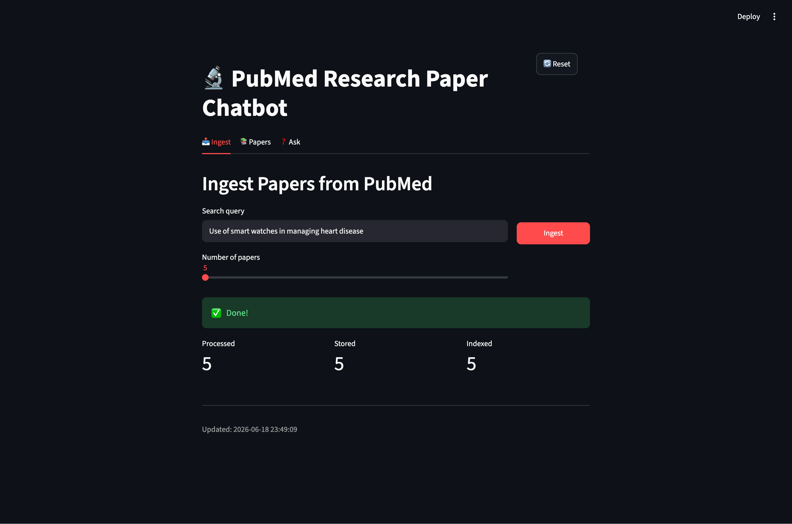
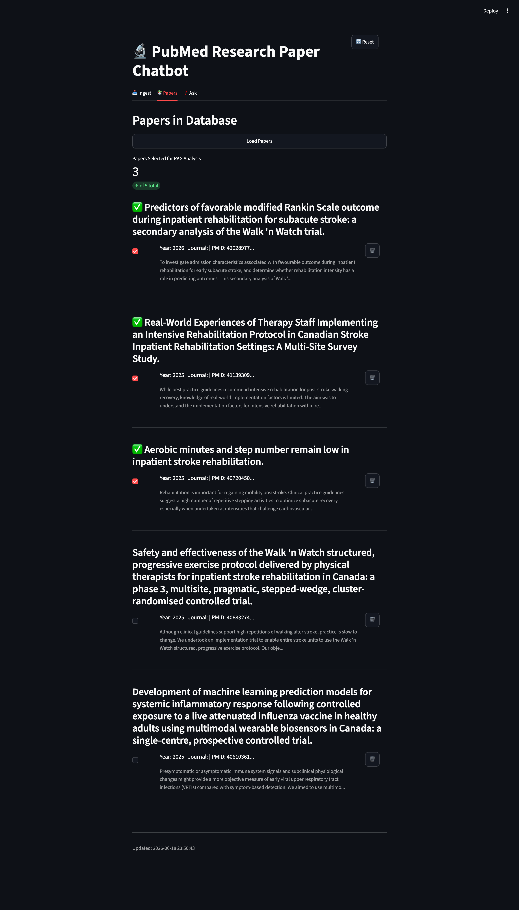
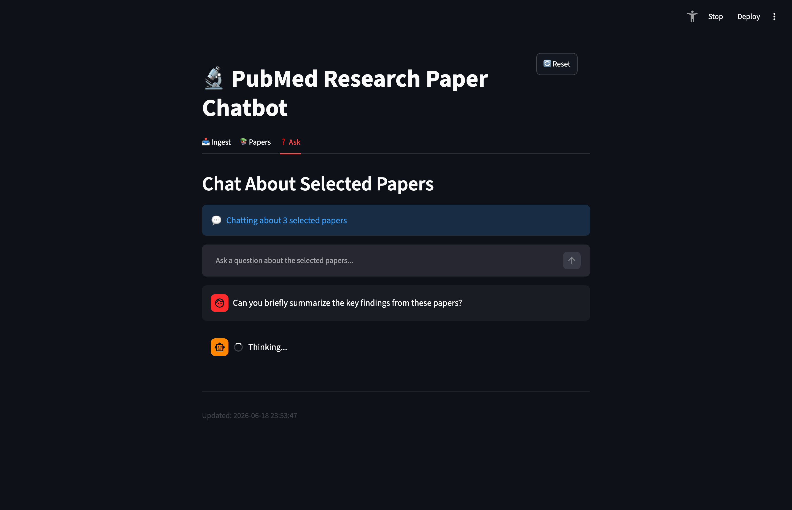
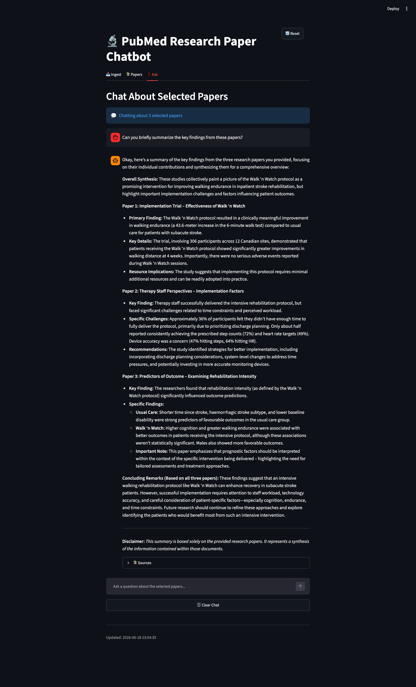

# PubMed Research Paper Analyzer

[PubMed](https://pubmed.ncbi.nlm.nih.gov/about/) contains more than 40 million citations and abstracts of biomedical literature.

This application allows you to search using PubMed, ingest research paper abstracts from your search, and ask questions about your selected papers using basic RAG (Retrieval-Augmented Generation).

## What It Does

1. **Ingest** — Search PubMed by keyword and pull in papers (title, abstract, authors, year, PMID).
2. **Browse** — View stored papers, select the ones you care about, or delete them.
3. **Ask** — Chat about your selected papers. Answers are generated from paper content and include source citations.

## Demo

The app has three tabs that follow a simple workflow: **Ingest → Papers → Ask**.

### 1. Ingest papers from PubMed

Search by keyword, choose how many papers to fetch, and ingest them into the local database.



### 2. Browse and select papers

Load stored papers, check the ones you want to analyze, or delete papers you no longer need.



### 3. Ask questions about selected papers

Chat about your selected papers. The app retrieves their content, sends it to the LLM, and returns an answer with cited sources.

| Generating an answer | Final response with sources |
| --- | --- |
|  |  |


## How It Works

[Diagram](demo_screenshots/pubmed_rag_pipeline.svg)


## Tech Stack


| Layer        | Tools                                         |
| ------------ | --------------------------------------------- |
| Frontend     | Streamlit                                     |
| Backend      | Flask API framework                           |
| Data         | SQLite, ChromaDB                              |
| Embeddings   | Sentence Transformers (`all-MiniLM-L6-v2`)    |
| LLM          | Ollama (`gemma3:4b`) via LangChain            |
| External API | PubMed E-utilities (NCBI) - No API key needed |


## Prerequisites

- Python 3.10+
- [Ollama](https://ollama.com/) installed and running
- Ollama model pulled: `ollama pull gemma3:4b`

## Setup

```bash
python -m venv venv
source venv/bin/activate   # Windows: venv\Scripts\activate

pip install -r requirements.txt
```

## Run

Start the backend and frontend in separate terminals:

```bash
# Terminal 1 — Flask API (port 5000)
python app/backend/api.py

# Terminal 2 — Streamlit UI
streamlit run app/frontend/streamlit_app.py
```

Open the Streamlit URL (usually `http://localhost:8501`).

## Project Structure

```
app/
  frontend/streamlit_app.py   # UI
  backend/api.py              # REST API
pipeline/
  ingestion/                  # PubMed fetch & parse
  processing/                 # Clean, normalize, dedupe
  embedding/                  # ChromaDB + embeddings
  retrieval/                  # Semantic search
  rag/                        # Question answering
db/                           # SQLite schema & repository
data/raw/                     # Cached PubMed responses
reset.py                      # Clear database / embeddings / raw data
```

## Reset Data

```bash
python reset.py --all          # Clear everything
python reset.py --db           # SQLite only
python reset.py --embeddings   # ChromaDB only
python reset.py --raw          # Raw PubMed files only
```

## API Endpoints


| Method | Endpoint             | Description                                       |
| ------ | -------------------- | ------------------------------------------------- |
| POST   | `/api/ingest`        | Fetch papers from PubMed and store them           |
| GET    | `/api/papers`        | List all stored papers                            |
| DELETE | `/api/papers/<pmid>` | Delete a paper                                    |
| POST   | `/api/ask`           | Ask a question (with optional selected paper IDs) |
| POST   | `/api/search`        | Semantic search without LLM                       |
| GET    | `/health`            | Health check                                      |
